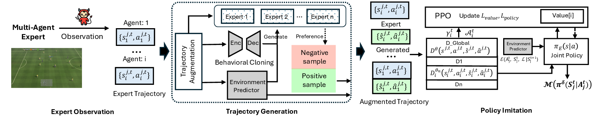

# HySteal: Stealing Attacks on Multi-agent Deep Reinforcement

This is the source code for our paper. 
Hysteal is a Learning-based Coordinated Cyber-Physical Systems
HySteal is a hybrid imitation learning system that frames multi-agent model stealing combining behavioral cloning and adversarial imitation to recover high-fidelity MADRL policies in complex CPS settings.

## Pipeline



## HySteal
 
- Train: runs the full pipeline HySteal training and evaluation.
```
bash HySteal/run_all_single_scale.sh
```
- Evaluate: evaluates a HySteal model on the selected environment.
```
HySteal/evaluate.sh ENV_TYPE /path/of/model.pt
```

## MARL

- Train: trains multi-agent reinforcement learning for the selected environment.
```
ENV_TYP bash MARL/train_maddpg.sh
```
- Evaluate: evaluates multi-agent reinforcement learning policy for the selected environment.
```
ENV_TYPE bash MARL/eval_maddpg.sh
```

