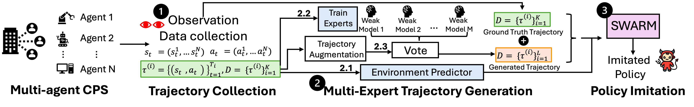
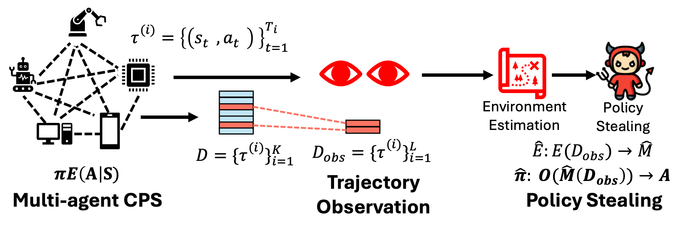

# SWARM: Stealing via Weakly-supervised Action
Representation Manifolds in MADRL-driven CPSs

This is the source code for our paper. 
Multi-agent Deep Reinforcement Learning (MADRL) models are foundational to modern Cyber-Physical Systems (CPS) and edge computing. As these proprietary models become valuable intellectual property, recent campaigns highlight their vulnerability to model stealing. However, the feasibility of extracting MADRL systems remains largely unexplored due to challenges like high complexity and partial observability. To expose this vulnerability, we propose SWARM (Stealing via Weakly-supervised Action Representation Manifolds), a novel adversarial extraction framework. Rather than cloning a rigid deterministic policy, SWARM learns a continuous behavioral manifold capturing the target system's inherent uncertainty. It leverages an environment predictor to reconstruct hidden dynamics and a weak expert trajectory augmentation mechanism to mitigate observation bias from sparse data. A Multi-Agent Generative Adversarial Imitation Learning (MAGAIL) module uses these augmented trajectories to map the broader behavioral manifold, reconstructing latent cooperative and competitive dynamics. Evaluations across four CPS environments show SWARM achieves rapid convergence and high-fidelity extraction, scaling seamlessly with negligible overhead. Furthermore, SWARM's manifold-learning approach inherently compromises state-of-the-art ownership defenses by stripping behavioral watermarks, neutralizing backdoors, and bypassing policy obfuscation. Finally, we explore countermeasures via data poisoning and provide initial mitigation results. As one of the first frameworks to demonstrate the reality of MADRL extraction, SWARM exposes a potent attack vector while establishing a foundation for next-generation resilient CPS architectures.

## Pipeline



## ThreatModel


## HySteal
 
- Train: runs the full pipeline HySteal training and evaluation.
```
bash HySteal/run_all_single_scale.sh
```
- Evaluate: evaluates a HySteal model on the selected environment.
```
HySteal/evaluate.sh ENV_TYPE /path/of/model.pt
```

## MARL

- Train: trains multi-agent reinforcement learning for the selected environment.
```
ENV_TYP bash MARL/train_maddpg.sh
```
- Evaluate: evaluates multi-agent reinforcement learning policy for the selected environment.
```
ENV_TYPE bash MARL/eval_maddpg.sh
```

